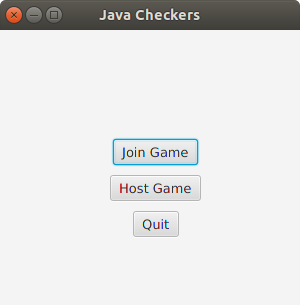
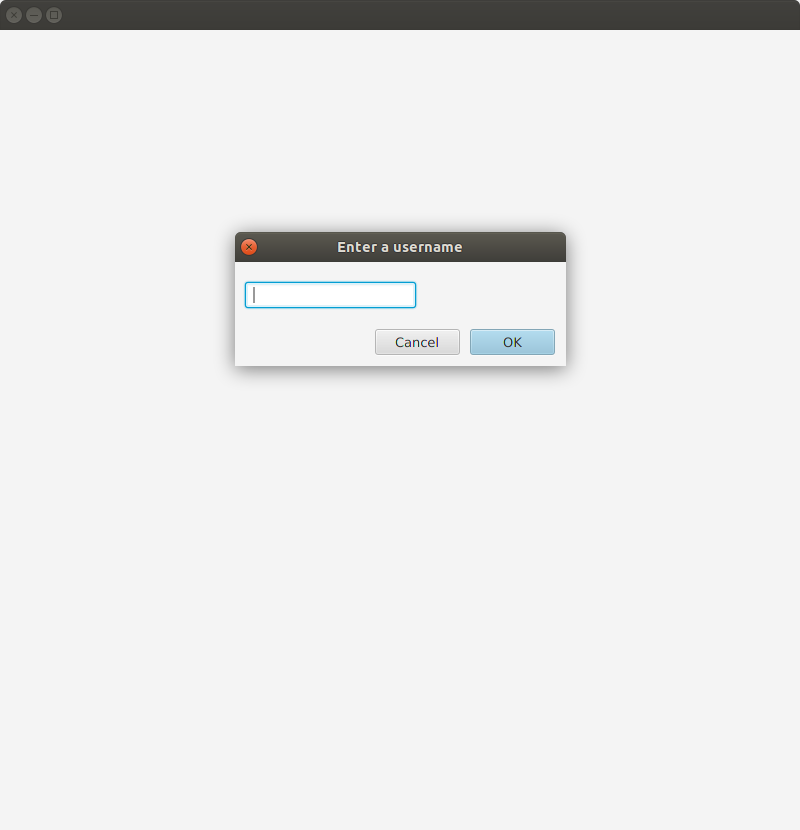
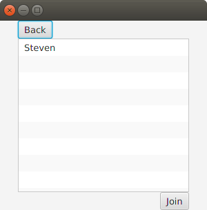
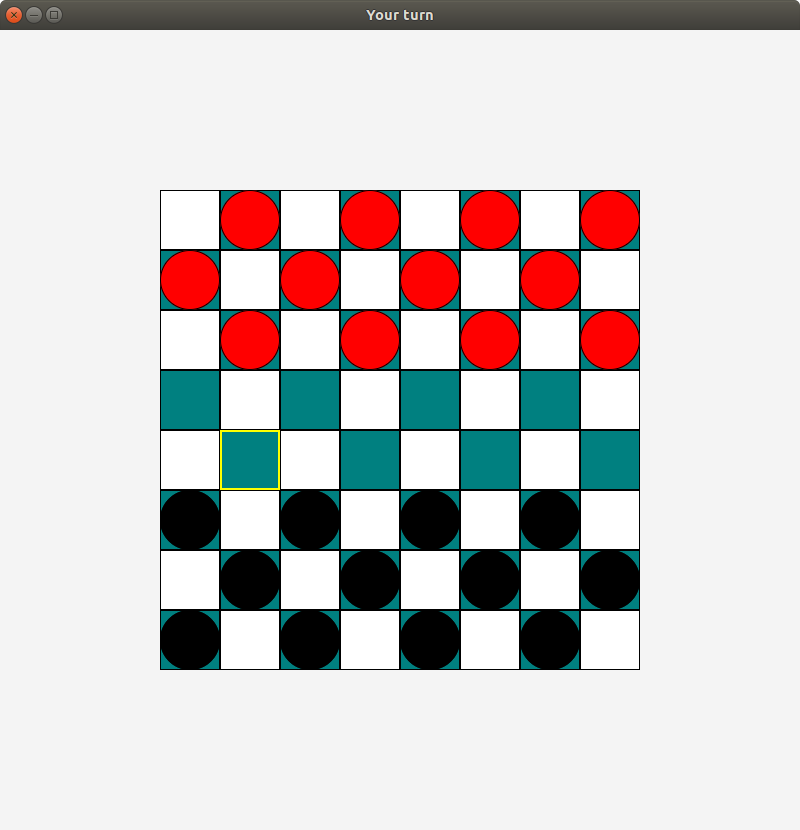

# Java Checkers

Java Checkers is a peer to peer networked checkers game written in java.  Play an exciting game of checkers with anyone on your local network!

You can download the latest version [here](https://github.com/KyleS22/JavaCheckers/releases/latest)

## Installation
There is currently one way to install the game

### Using the .deb 
There is a `.deb` file available for installing the game on linux platforms.  Install this the way you would normally install a `.deb` file on your machine.

## How to play
When the game starts you will be presented with a menu.  There are three options: "Join Game", "Host Game", and "Quit".  If you don't want to play the game, choose quit.

When you choose "host game", you will start a server that another player on your local network can join.  A window will appear asking for a username (you can put whatever name you like here), and then you will have to wait for another player to join.

When you choose "join game", you will be prompted to enter a username, and then you will be displayed a list of active hosts you can join.  If this list is empty, there are no games available.  The list will display the usernames of available hosts for you to join.  Select one and then click the "Join" button and the game will start.

Once the game has started, the window title will indicate whose turn it is (Black always goes first).  On your turn, select the piece you would like to move.  The legal moves that piece can make will be highlighted in yellow.  When you choose one of these highlighted squares, your piece will move and your turn will end.

### Developer Documentation

Check out the Javadoc generated documentation [here](https://kyles22.github.io/JavaCheckers/docs/javadoc/index.html)
